# Character editor 角色编辑器

## 各位创作者，大家好！
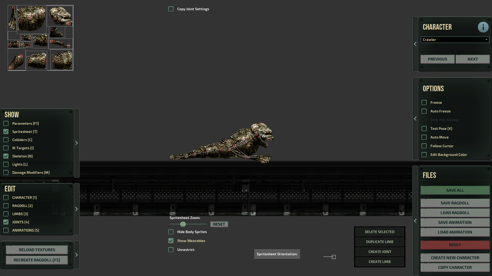  
*原内容由itchyOwl于v0.9.5.0编写*  

<!-- In Barotrauma, all characters have a **character config file**. A character config file defines visual things like sounds and particle effects as well as functional things, like how the character acts, how much health it has, and whether or not it can walk. A character config file also contains references to the ragdoll and animation files. -->  
在潜渊症中，所有的角色都有一个**角色配置文件夹**。角色配置文件夹定义了视觉内容如声效，粒子特效和功能性内容，比如角色如何行动，有多少生命值，是否能够走路。角色配置文件夹同样包含布娃娃模型和动画文件的引用。  
*译者注:原文"...A character config file defines visual things like sounds and particle effects...，个人难以理解为何声效被纳入了视觉内容的范畴。*  

<!-- A **ragdoll file** defines the physical dimensions of the character: How many limbs and joints does it have? At what coordinates are they found on the texture? How much does the character weigh? What are the relations of the limbs to each other and how they constitute the skeleton or the physical 'ragdoll' of the character. A ragdoll file also contains things like damage modifiers \(armor or weak spots\), lights, and attacks. -->
布娃娃文件夹（ragdoll)定义了角色的物理规格：有多少肢体，关节。贴图的坐标在哪，角色有多重，每个肢体之间有什么关联，又如何构建成角色的骨架或角色身体的“布娃娃"。文件中也包含了例如伤害修正（盔甲或者弱点导致的），色泽属性，攻击的相关属性等。  

<!-- The movement of the character is defined in the **animation files**. The animation files contain things like forces, multipliers and other variables that define the forces applied on the ragdoll when it moves. Each animation type is defined in a separate file. For a character that can move, that would mean four different files: Walk, Run, SwimSlow, and SwimFast. -->
一个角色的移动是在**"Animation"**文件（下称动画文件）中定义的。动画文件中包含了如理量、修正系数和其他定义作用于布娃娃运动的力量的变量。每一个动画类型都是由独立的文件定义的。对于一个可以移动的角色来说，其需要四个不同的问文件:walk(走）、run(跑）、SwimSlow(低速游泳）和SwimFast(高速游泳）
。
<!-- In the character editor, you can edit all the character files without having to worry about .xml editing. In the following, you can find more detailed instructions for editing each of these files or aspects of the character. -->  
在角色编辑器中，你可以编辑所有的角色文件并且不用担心.xml文件的编辑。接下来，你将能在这里发现更细致的关于编辑角色的各个文件和方面的指导。

<!-- **TIP**: Use the number keys \[1\] to \[5\] on your keyboard to quickly switch between the different edit modes. -->  
**提示**：使用数字键1-5可以快速切换不同的编辑模式。


## Creating a new character  创造一个新角色  
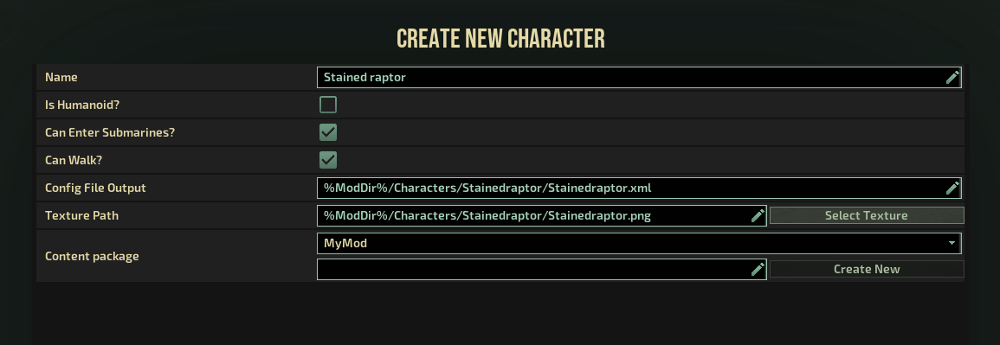

<!-- To create a new character, click the 'Create New Character' button found on the 'Files' panel. The following view will ask for basic information about the character you are about to create. The paths to the config file and the texture path are both relative to the Barotrauma project folder. -->  
如果要创造一个新生物，请点击在‘files'选单上的"create new Character"(创造新角色\生物）按钮。之后弹出来的窗口中会向您确定你要创造生物的基本信息。其配置文件和贴图文件都是相对于潜渊症游戏目录定位。


<!-- The 'Config File Output' is the path to the character config file. At this point, the file does not yet exist: it will be stored on disk when the character is created. You can change the path here, but the default should be fine too. -->  'Config File Output' 是角色配置文件的路径。在这个时候，实际文件还没有生成：当你橘色创造后才会储存在硬盘上。您可以在这个页面改变路径，但默认路径应该不至于要换。  

<!-- One thing you should have on hand at this point is a **texture** for the character. In Barotrauma, all characters are made of limbs that have a sprite. In practice, you'll need a sprite sheet, where the sprites for all the limbs of your character are found. -->  
在这个阶段需要你动手的是角色的**贴图**.在潜渊症中，所有的角色由具有贴图的肢体组成。实际上，你需要一个包含所有你角色具备的肢体的总贴图集。  

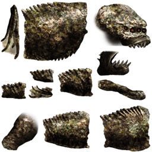

<!-- You also need to select or create a new **content package** for the character, which contains the custom content for the game. A content package is essentially a mod. Select the content package you want to use for the character or create a new content package by providing a name for it and clicking the 'Create New' button.--> 
你同样需要选择或者为角色创造一个新的**内容包**——其会包含了游戏的自定义内容。而一个内容包本质上是一个mod。选择一个你想为角色用的内容包或者通过提供命名新的内容包并点"Create New"按钮即可。

<!-- Once you have filled out the basic information, you can define some limbs. Use the '+' and '\-' buttons to add or remove limbs. You can also add multiple limbs by defining a 2D grid \(the 'X' and 'Y' fields\) and pressing the 'Add Multiple' button. -->
当你填好了基础信息之后，你就可以开始定义一些肢体（limbs)。使用‘+’或者‘-’按键来添加或者移除肢体，你也可以通过定义2维网格坐标（X和Y）增加多个肢体并按下"add multiple"按键.

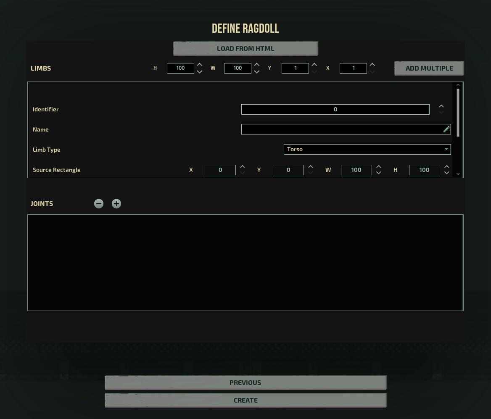

<!-- Don't worry too much about the definitions here. We just want to add some limbs that we can edit later on. It's also possible but currently not advised to define the joints here. It can be done later much more easily. -->  
不用太担心这一块的定义，我们只是想添加一些我们之后再编辑的肢体在这罢了。这个页面也可以用来定义Joints（关节），但晚点去无疑会更方便。


## Limbs 肢体
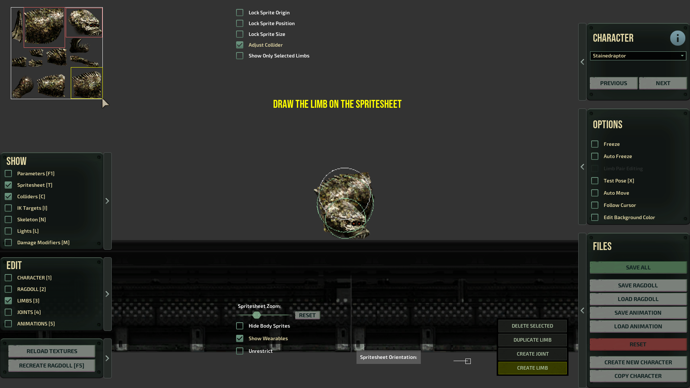

<!-- When you are done with adding some limbs, click the 'Create' button. At first, your character will look a terrible mess with all the limbs on top of each other. This is because there aren’t any joints yet to join and keep apart the different limbs. For now, let's just ignore how the character looks in the game view; it won't look right before we add the joints. -->  
当你添加了一些肢体之后，点击‘Create’按钮即可。在这之后，首先你创建的角色可能看起来会混在一团。这是因为还没有任何的关节（joints)去将其组合并区分不同的肢体。就现在而言，暂时忽略角色在游戏中的外观，在添加好关节节点之前，这些外观都不是最终成品。

<!-- **TIP**: You can add limbs after creating joints and create joints before the limbs are final. However, it's easier to define the limbs first. Then the joints. And then iterate. -->
**提示**:你可以在创建关节（joints)之后再添加肢体（limbs)，也可以再肢体完善前再加入关节。然而，先定义肢体再添加关键，循环往复会容易不少。  

<!-- Before going into how we add joints, we should first adjust the **source rects** and the **colliders** of the limbs. Source rects are simply definitions about the position and the dimensions of the limbs; they mark where the limb is on the texture file \(in pixels\). Colliders, on the other hand, are the physical definitions of the limbs. They determine how the limbs move in the game world. Note that if the colliders are of a wrong size, the collisions won't work right. If the colliders are too small, the ragdoll can be unstable and even explode. -->
在学习如何添加关节（joints)之前，我们首先需要调整肢体的贴图框和碰撞箱。贴图框是肢体位置和尺寸的简要定义，他们标记了肢体在贴图文件的哪一块上（在像素层面）。而另一方面，碰撞箱则是从物理角度对肢体进行定义。他们决定了这些肢体在游戏世界中如何移动。值得注意的是，如果碰撞箱的大小不对，那么碰撞箱是无法正常工作的。如果碰撞箱太小，那么角色的布娃娃状态就会不稳定，甚至爆开来。  


<!-- OK, let's start editing. First, make sure that you have the 'Spritesheet' and 'Limbs' toggles selected on the 'Edit' panel. Also cross over the 'Adjust Collider' toggle found on top of the screen. -->
说了这么多，让我们开始动手吧。首先确保你已经将‘Spritessheet’（贴图）和‘limbs’（肢体\四肢）在编辑选项选单上选上了。同样将屏幕顶部的“adjuset Collider"（调整碰撞）给选上。

<!-- **TIP**: You can change the collider shape by adjusting the collider dimensions from the parameters. Enable the 'Parameters' toggle to see the parameters of the selected limb. -->  
**提示**：你可以通过调整参数中的碰撞箱尺寸来改变碰撞箱的形状。在选单上勾选"Parameters"(参数），来看所选肢体的尺寸。（先看后面再看这里）

<!-- You'll now see the colliders of the limbs drawn in green over your character. Select the limbs over the sprite sheet. Drag the small box in the top left corner to move the source rect, and the box in the bottom right corner to adjust the size of the source rect \(and the collider\). -->  
你现在可以看见肢体的绿色碰撞箱在你的橘色上，选中贴图上的肢体，方框坐上角来移动贴图框，方框右下角调大小调节贴图框（和碰撞箱）  

<!-- **IMPORTANT**: When the 'Adjust Collider' mode is enabled, the colliders are automatically recalculated when you edit the source rects. This will overwrite your manual adjustments! -->  
**重要提示**；当你勾选上“adjust Collider"的时候，碰撞箱会随着你贴图框变化自动重新计算。这会覆盖你的手动调整。（如果调了没动静按刷新）

<!-- **TIP**: Use the arrow keys to move the source rect one pixel at a time. Hold Left Control to adjust the size of the source rect. -->  
**提示**；使用方向键可以以一次一像素的形式移动贴图框。如果再同时按住左ctrl，可以用于调整贴图框的大小。

<!-- You can add more limbs by duplicating an existing limb or by creating a new limb. Enable the 'Limbs' mode in the 'Edit' panel. Now the buttons on the lower right should become enabled. Press 'Create Limb' and draw a rect over the sprite sheet where the limb should be found on the texture. Releasing the mouse button should create the limb. -->  
你可以通过复制现有肢体添加更多的肢体。在编辑选单里面勾选上"limbs"，然后右下角的那些按钮（包含复制肢体）就出现了。按下“create limbs"(创造肢体）并在贴图表中框选这个肢体上应有的贴图（左键按住，框），松开鼠标后就会创造出一个新的肢体。

<!-- **TIP**: Most of the limbs can also be deleted, but there are some restrictions to this. If joints or limbs don't get deleted or added correctly, or you have some other issue in the editor, take a look inside the .xml file. You can manually add or remove limbs and joints in the .xml too. -->  
**提示**：大多数的肢体也都可以被删除，但有一些限制。如果关节（joints）和肢体（limbs)没有能正确地增加或者删除或者你在编辑器里面出了点其他问题，你也可以打开对应的.xml文件，手动添加\删除肢体和关节。  


## Joints  关节  
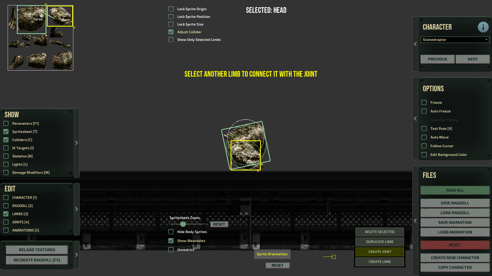

<!-- When you are done with the main limbs \(you don't have to define all of them at once\), you can start creating joints between the limbs. -->
当您完成了主要的一些肢体（不必一次性全部做完），你就可以开始创造关节连接做好的肢体了。  


<!-- Make sure to have the 'Limbs' mode selected. Then select a limb, and click the 'Create Joint' button \[ctrl+e\]. You can now draw a joint between two limbs. First select the starting point of the joint inside the currently selected limb by clicking somewhere inside the limb's source rect on the sprite sheet. After that, you'll need to define the other end of the joint. To do that, hover your mouse over the limb you want and select it with the left mouse button. Note that the location matters: the other end is created at the position of the mouse. This can of course be changed after the joint has been created. -->  
请确保编辑选单的‘limbs’模式是选上的。然后再选择一个肢体，点击‘create joint'(创造关节）按钮（或者快捷键ctrl+e。然后你就可以再两个肢体之间创造关节了，首先在当前选好的肢体上选择一个锚点，。然后你需要决定关节的另一端。为了实现这一点，，将你的鼠标悬停在你想要的那个肢体上（会显示肢体名字），并用左键选择。注意，另一端的定位就在你鼠标的位置。当然，在创造关节之后这个点是可以调整的。  


**TIP**: Press \[ctrl\] to select and edit multiple limbs or joints at the same time.

**TIP**: In the joint editing mode, click 'Copy Joint Settings' to copy the settings of the first selected joint to the other joints.

The editing mode should now automatically change to 'Joints'. In this mode, we can see the joint ends drawn as red circles. If you select one of the circles, it will change the color and show three small widgets next to each end of the joint.

**TIP**: You can edit and create limbs and joints also over the character in the game view, but it's usually easier to do it on the sprite sheet.

Try dragging the circular widget. This is the **anchor point of the joint**. It defines the point where the limb is attached to the other limb. The longer the distance between the two ends, the longer the joint. And the longer the joint, the farther the limbs are from each other.

**TIP**: If the limbs seem to be on top of each other and the joint ends look correct on the sprite sheet but wrong in the game view, try flipping the joint ends \(i. e. just drag them so that they swap places\).


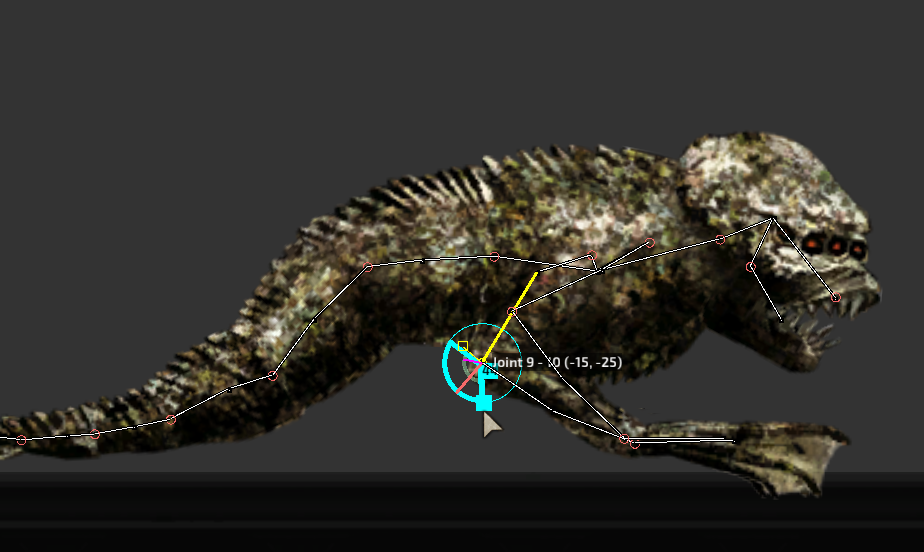

When you get both joint ends in place, select one of the rectangular widgets. These are the joint angle controls. They define **the limits of joint rotation**. There's an upper limit and a lower limit. By default both are set to 0. When the joint limits are at the same value, the joint is not allowed to bend at all. The upper limit should always be higher \(or the same\) than the lower limit. Both limits go clockwise from \-180 degrees to 180 degrees.

**IMPORTANT**: By default, the rotations start from the bottom \(\-180\) and also end at the bottom \(180\) meaning that 0 degrees is at the middle point, i.e. pointing up. 'Spritesheet Orientation' is the setting that adds an offset to this. Enable 'Spritesheet' on the 'Show' panel to see the orientation controls.

**The line should point to the local up (or forward depending on how you think about it) of the texture sheet.** For example for the vanilla human, the up is 0 and for the Crawler it's 90 degrees.

Note that if you have a limb selected, the text will be 'Sprite Orientation'. And if you now change the orientation, the text and the controls turn yellow. This means that you have edited the offset for the selected limb only. To undo this, press the 'Reset' button next to the controls.

It's possible, for example, to define some of the limbs from left to right and others from top to bottom. In this case be sure to set the orientations right for each of your limbs or the angle controls will be pointing at a wrong direction!


## Ragdoll
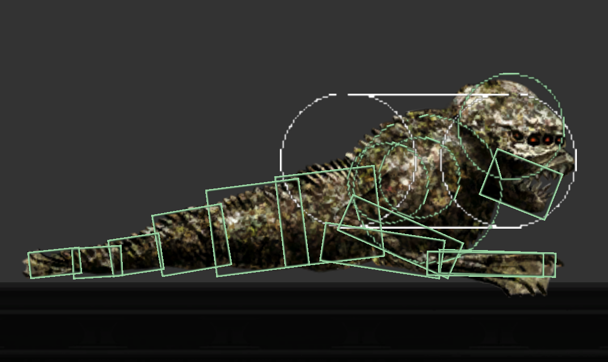

At this point, you should have a character with some limbs and joints. Limbs and joints together constitute the skeleton of a character, or a ragdoll, as we call it. Enable 'Skeleton' on the 'Show' panel to see the ragdoll drawn over the character.

A ragdoll has several settings that are not limb\-specific. These settings can be edited by selecting 'Ragdoll' on the 'Edit' panel. On the right, you will now see the following settings:


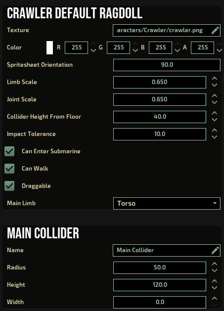

The main collider is an approximation of the character's dimensions used for animations, multiplayer syncing and AI decisions. When you have the 'Colliders' mode enabled, the main collider is drawn in white \(capsule/circle/rectangle\) over the character. It's important that the collider is of an approximately correct size and at the right position on the character. To adjust the position of the collider, you can change the 'main limb' parameter. By default, the main collider is placed where the torso or the head limb is at.

**IMPORTANT**: At this point you should check that at least the most important limbs of your character have the limb types properly defined. Select the 'Limbs' mode and enable 'Parameters' to see the limb parameters for each limb in the parameter editor. Make sure that the character has a torso and/or a head, that the legs and arms are defined as such, and that the tail limbs are given the type 'Tail'. If the limb types are wrong, the animations will not work as intended, because the system doesn't know which limb it should move to make the character swim or walk, for example.

For characters that can walk, it's also important that the 'Height From Floor' parameter is given a reasonable value. Otherwise the character won't stand where it should. This parameter doesn't have any effect on swimming characters.

**TIP**: When you have limbs or joints selected, only the selected elements are shown in the parameter editor. If you want to see all the limbs or joints, deselect all by clicking the right mouse button.


## Animations
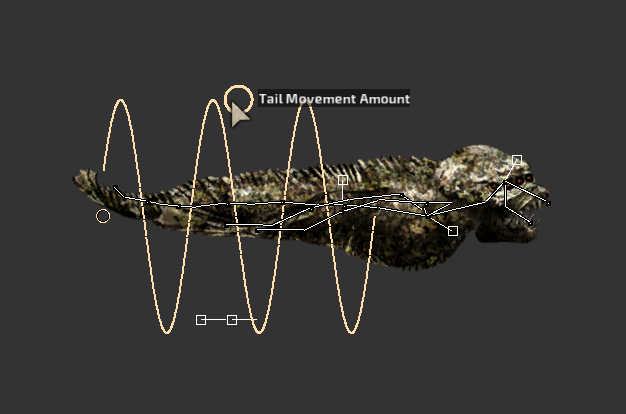

Animations are what make characters alive. Unlike in many other games, in Barotrauma the characters are entirely driven by physical forces. When we make the feet of the character take steps, or its tail swing when the character swims, we actually define forces on the limbs.

Doing this kind of physical animations is a bit different from ordinary keyframe based animations. We don't have the same control on the movement. No exact poses for the character, nor animation clips. Instead, we have parameters and can provide some visualizations of them. The upside is that the animations can adjust to the environment without any kind of tweening or blending from an animation clip to another. So it can be more flexible and less work per character, because many things are almost automatic.

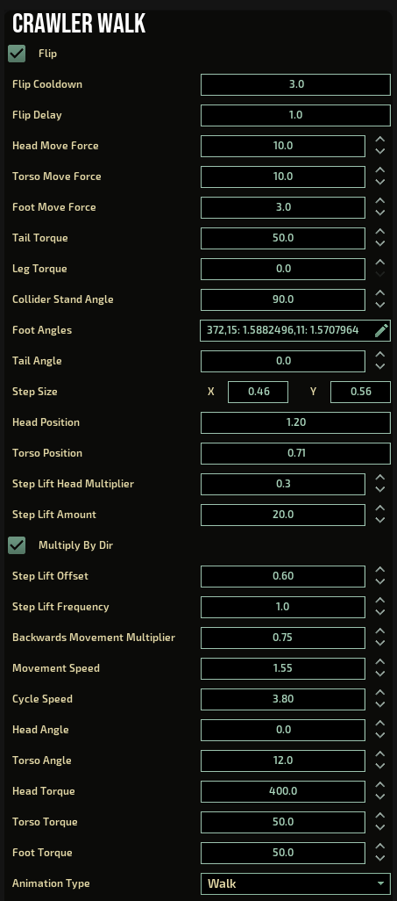

There are currently four **animation types** for the characters that you can edit: 'Walk', 'Run', 'SwimSlow', and 'SwimFast'. Each of the animations is defined in a separate file and they have distinct parameters. Some of the parameters are common to all, some specific to the animation type. Most of these you don't have to worry about, because you can easily experiment with the widgets that are drawn over the characters.

**TIP**: Press \[e\] to switch between walking and swimming animations. Press \[Left shift\] to switch between slow and fast movement animations. There's also a drop down for selecting the animations.

However, there are some important parameters that you can edit only in the parameter editor. Select 'Parameters' on the 'Show' panel to open the parameter editor.


**TIP**: When the parameter editor is open, you can see which parameter\(s\) you are changing when dragging a widget over the character. The parameters that are updated should flash in green.


## Character config parameters
A character’s config parameters define visual things like sounds and particle effects as well as functional things, like how the character acts, how much health it has, and whether or not it can walk. The parameters are stored in the character config file.

Enable 'Character' on the 'Edit' panel to see the character config parameters.

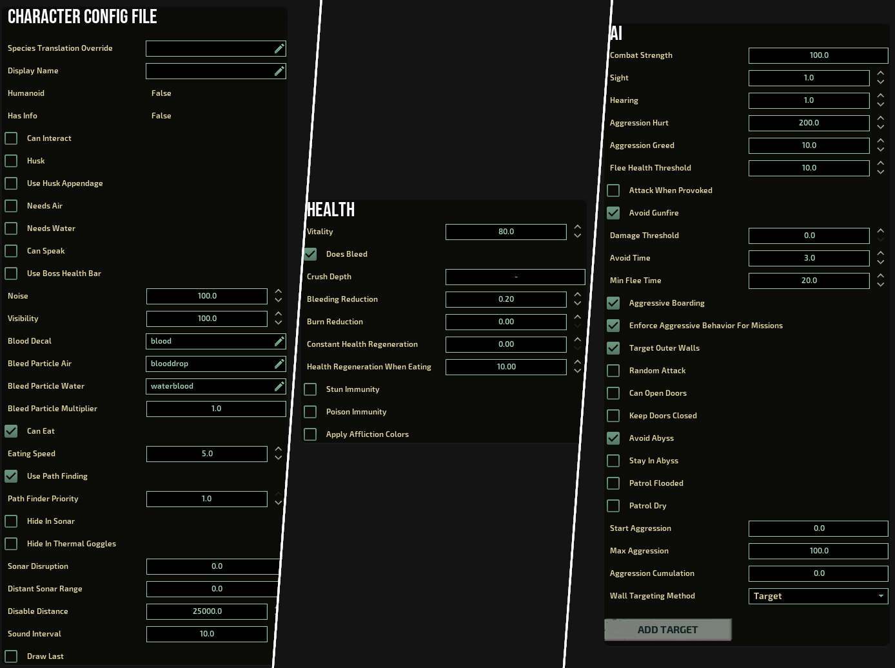

The AI section is an important one and might require a bit of explaining. Note that these settings *only apply to non-humans*. The human AI is a separate beast altogether.

In the AI section, you can add targets with priorities and states. These are used by the AI to make decisions about which things the character should target, which state it should use while targeting, and what \(base\) priority should be given to this target. The actual priority is determined by dynamic factors like distance from the target.

You might also want to add some sounds and particles \(like blood\) to your character. If you want the character to drop some items, give it an inventory too.

**TIP**: The AI characters only target entities that have `<aitarget/>` tags in the XML definition. For some things, like the walls, this tag is added automatically in the code.


## Damage modifiers
When you select a limb and enable the parameters \('Show' \-\> 'Parameters'\), you might notice that there are some things that are not yet explained in this guide. These are: attack, damage modifier, sound, and light. All these are optional settings for the selected limb\(s\). They are not visible, if no limb is selected.

I'm not going to go through all the options in detail, as there are tooltips in the editor and you should be able to figure them out by experimenting. However, there are some things that probably need a bit of explaining.

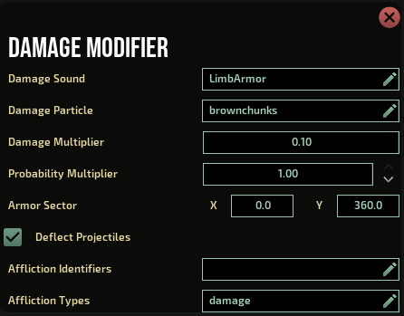

Let's first take a look at the damage modifier. A damage modifier defines a multiplier for certain damage types. If the multiplier is above 1, the modifier increases the final damage on the character when it's hit on the selected limb. If the multiplier is below 1, the damage is reduced.

If you enable 'Damage Modifiers' on the 'Show' panel, all the modifiers that decrease the damage are drawn on green over the character and the modifiers that increase the damage are drawn on red.

Damage modifiers are defined as sectors \(in degrees\) beginning from the top \(0\) and ending at the top \(360\) when looking at the sprite sheet. Note that sprite sheet orientation doesn't have any effect on this. For example, if you'd want to define a damage sector that only affects the upper side of the sprite, you would define it as x: \-90 and y: 90.


## Attacks
Another thing that might require an explanation is the attack section. To add an attack, press the 'Add Attack' button, which is visible when you have a limb selected and when you have enabled 'Parameters' on the 'Show' panel.

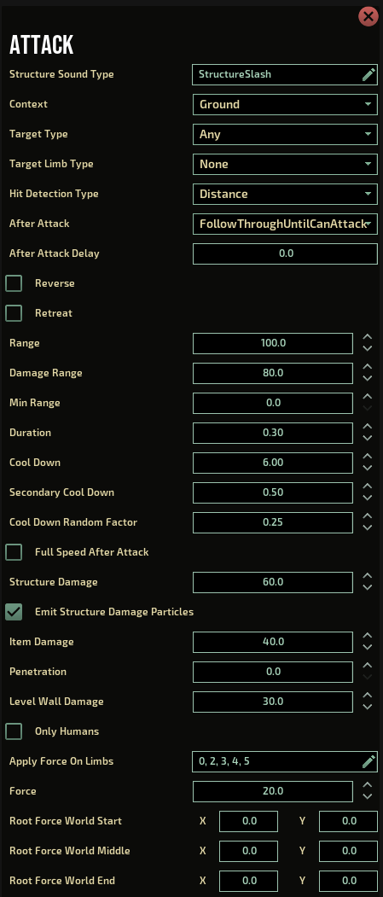

When a creature uses the attack, the forces defined in the attack parameters are applied on the attacking limb. This creates the attack 'animation'. The forces can be applied only once or during the entire duration of the attack. When a legitimate hit is registered, the attack can also apply forces on the target that was hit. Note that these two things are completely separate from each other!

Attacks have a 'Context' and a 'Target Type' that can be used to restrict their use. By default, an attack can be used anywhere and against any target.

The hit detection type defines the method of how the hit is evaluated: a distance or a contact \(collision\). A distance\-based attack hits the target if it's closer than what is defined in the 'Damage Range' parameter. Note that the distance is calculated from the center of the limb, not from an edge. In some cases, the contact\-based method might be better because it's more precise. The downside is that it cannot hit targets that don't actually hit the collider of the attack limb.

It's important that the 'Range' is not too high or the 'Damage Range' too low, or the character won't hit its target. Likewise, it's important that the 'Duration' of the attack is not too low, or the attack might miss the target.

Note that currently each limb may only have one attack \(for the sake of simplicity\). If you need to define multiple attacks on head, for example, you can always create an extra limb and hide it. You might also want to disable the collisions for this hidden limb. This can be done by selecting the limb and crossing over the 'Parameters' option on the 'Show' panel.


## File structure
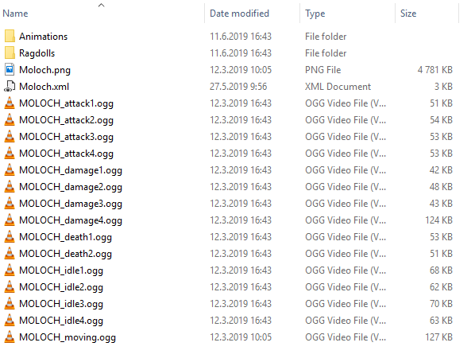

When you create a new character, you are asked to define a path for the character config file \(e.g. %ModDir%/Characters/Mycharacter.xml\). It's strongly advised that the texture and sound files are placed in the same folder or in subfolders at the same location as the character config file.

When a new character is created in the editor, the system automatically adds the reference to the character config file in the content package and creates the animation and ragdoll files for you.

If you don't want to use the default paths, you can change the paths in the character config, by changing the values for the 'folder' attributes of 'ragdolls' and 'animations' elements.

```xml
<Character SpeciesName="Stainedraptor" ...>
  <ragdolls folder="default" />
  <animations folder="default" />
  ...
```

**IMPORTANT**: Don't rename the animation or ragdoll files or the game won’t be able to use them. This will hopefully be changed at some point, but for now, just use the default filenames.

**IMPORTANT**: To avoid issues with the file structure, please capitalize the first letter in the character name and nothing else. The character name should match the folder name and the species name \(found in the character config file\).

**TIP**: You can have multiple ragdolls and animations for a single character, but currently only the defaults are used in\-game.

**TIP**: Everything you edit in the editor has a representation in the .xml files. If you edit the animations, the animation files will change. And if you edit the ragdoll, the ragdoll file will change.


## Limitations
There are some limitations to keep in mind when using the character editor. We work to reduce the amount of limitations, going forward. Also note that all the limitations can be overcome by manually editing the .xml files.

The current limitations in the character editor are the following:

- Unlike the animation parameters, many of the ragdoll parameters are not updated at runtime. Click 'Recreate Ragdoll' or press F5 to see the changes applied.
- Not all aspects of humanoids are exposed in the editor.
- Some AI behavior, like latching or swarming cannot be edited in the editor.
- There is no support for status effects in the character editor.
- Conditional sprites or damage overlays are not visible or editable in the editor.
- Sprite deformations are partially editable, but you cannot add or remove them in the editor.
- Decorative sprites are not editable in the editor.

## Publishing your character
Publishing a custom character is the same as any other mod, see the [Publishing](../Intro/Publishing.md) page for instructions.

## Thanks for reading!
We hope you found this guide helpful. It’s still a work in progress, so all feedback is most welcome! We look forward to seeing your awesome custom characters on Barotrauma's Steam workshop. If you have any questions, please use the \#baro\-modding channel on our [Discord](http://discord.gg/undertow)  or the Workshop Discussions subforum here on Steam.


