# 潜艇编辑器（Submarine editor）  

## 各位潜艇作者，大家好!
*原内容由TorpedoMike, Chad Husk and Hexcode Guy编写*

<!--This is the Barotrauma dev team's official manual for building your own fleets. It's the second version, updated to include the various changes to the editor, especially the reworked character mode. This guide will hopefully help you get a handle on the most important aspects of sub building by introducing the key concepts and functions of the submarine editor.-->  
本指南由潜渊症官方开发团队编写，旨在帮助各位建造自己的潜艇。作为第二版，更新了对于编辑器的各种修改，尤其是重做后的角色模式。指南将通过介绍潜艇编辑器中关键的概念、功能以期您能理解潜艇制造中各个重要部分。  
 
<!--**TIP:** Up\-and\-coming sub designers can find some dev\-made examples [here](https://steamcommunity.com/sharedfiles/filedetails/?id=2218926158) about how to setup the most essential systems of any submarine in the editor.-->  
**提示：** 期望进步的潜艇作者们可以在 [这里](https://steamcommunity.com/sharedfiles/filedetails/?id=2218926158) 找到一些由开发者制作的一些关于如何在编辑器中建立潜艇的必要系统的实例。  

## 潜艇结构（Submarine structures）  
<!--Different kinds of walls and platforms are used to keep oxygen inside and monsters outside, and to divide the interior space into smaller rooms and compartments.-->   
各种各样的墙体和平台是用于保持氧气在艇内，怪物在艇外，并将船内的空间分割为小房间和舱室。  
  

<!--When making a new submarine, it’s always a good idea to have a general plan of its shape and layout before building the outer hull. It’s a lot easier to add room inside for that oxygen generator you forgot to include, at first, if you don’t have to move all those carefully placed shell pieces, fins and lights just to create a bit more space. So starting with the outside hull is not necessarily the best course of action.-->  
当制作一个新潜艇的时候，最好在制作各个舱室（hull)前对于潜艇的形状和舱室规划有一个大概规划。想想看，如果你不必去动哪些你之前精心排布号的船壳、鳍板和灯光组件以求扩大那一点空间，那么为你一开始忘记计入的制氧机去增加其需要的空间就简单不少了。因而从外侧舱室开始建造潜艇并不一定是最好的方案
  

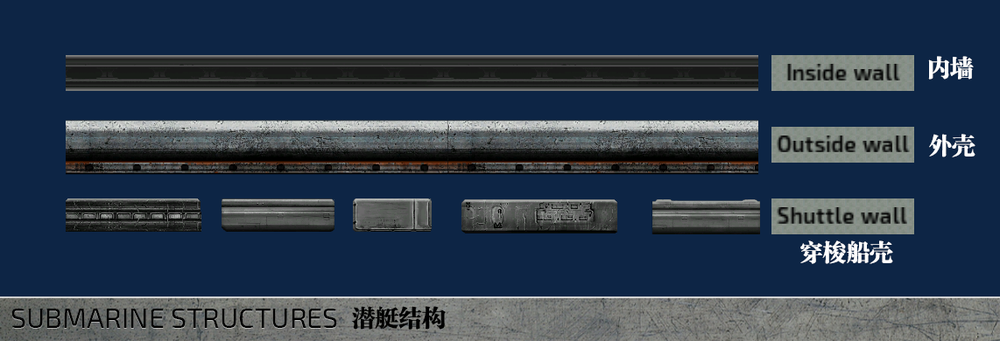

<!--Outside walls are by default sturdier than inside walls. Shuttle wall pieces are somewhere in between. You can edit the "max health" for each wall piece individually. This value is used as the base health for the walls, boosted multiplicatively by the hull upgrades the player can buy.-->  
外壳（outside walls)往往默认比内墙更坚固，而穿梭艇外壳则介于两者之间。您可以对每一段壳体都分别独立修改“最大生命值”（max health)作为其基础生命值，可以通过游戏中的船壳升级继续提升。  

<!--We suggest using the walls as labeled for a more balanced experience, but of course it’s not mandatory. Best results often come when experimenting with different options.-->  
我们推荐您使用带有标签的墙体以获得的更平衡的体验，但并不强求。最好的成功往往来自于对各种不同选项的尝试。  

<!-- After a piece of a wall \(or most things in the editor, really\) is placed, it can be **flipped** by it’s x\- or y\-axis by selecting it and pressing ‘Mirror X’ and ‘Mirror Y’ \-buttons or CTRL+N or CTRL+M. Nudge it via the arrow keys.-->  
在一段墙体（或者说大部分编辑器里的东西）被放置后，可以通过选中再按 ‘Mirror X'(水平翻转）或 'Mirror Y'(垂直翻转）和 CTRL+N 或 CTRL+M 实现x轴或y轴的**翻转**  

<!-- **TIP:** If you’re feeling lost or need inspiration, open one of the ready\-made submarines in the editor and take a look at how they’re built.-->  
**提示：**当你觉得缺乏或需要一点灵感的时候，可以打开编辑器中已经造好的潜艇来看看它们是如何被创造的。  

<!-- **TIP:** Tall subs tend to be less usable than long subs, and can look a little weird and off balance when in play. Crew should probably not need to climb up 5 stories of ladders to get to a leak or a fire.-->  
**提示：** 竖直方向高的潜艇往往再使用方面不如水平方向长的潜艇，而且看起来也会有点奇怪且在游戏中失衡。船员应该尽可能减少需要爬五层的梯子才能去修补漏洞或者灭火的情况。  

## Hulls and gaps 舱室和通道
> 译者注：这一段内容因为hull和gap在编辑器中默认没有翻译，所以在文本中的hull和gap都会保留，部分情况下会补充中文方便理解句子的含义  

<!-- >Rooms inside subs in Barotrauma are defined by **hull** objects. If there are no hulls in the sub, there is nothing separating the sub from the water outside. Hulls also determine the overall size \(= volume and mass\) of the sub. -->  
在潜渊症中，潜艇内的各个舱室是由名为 **hull**（舱室）的物件定义的。潜艇内部如果没有hull,那便不能区分出潜艇和外部的水。hull的大小数量也决定了潜艇整体规模（等同于体积和质量）。  

<!-- Hulls are displayed in the sub’s status monitor. Along with a room’s name, the monitor is capable of displaying the water level and quality of oxygen in a room. You can change what information is shown and if any sensors are required by modifying the status monitor.-->  
hull(舱室）会在潜艇的状态监视器中显示。除开房间名字以外，监视器还能显示各个hull中的水位、氧气含量。通过修改状态监视器组件，你可以改变其显示的信息与所需的检测器。

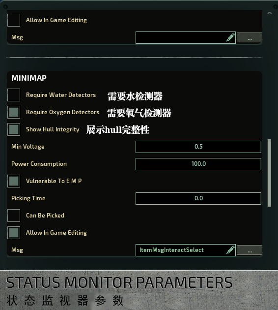

<!-- In non\-rectangular rooms, it’s often necessary to use multiple hull objects to cover the whole area. Link hulls together by selecting one hull, then holding space and clicking on another. This way linked hulls are displayed as a one, larger set. It also helps AI characters perceive linked hulls as a single room.-->  
对于不方正的舱室，就需要用多个hull来覆盖整个想要的区域。通过选中一个hull在按住空格点击另一个hull使两个hull连接，这样的两个hull就会被视为一个大整体。这个操作通用能让ai将其识别为一个舱室。  

<!-- **TIP** : Hulls can be named in the editor. The main purpose this serves is to provide an easy, customizable way to refer to different spaces. In some cases the AI also uses hull names to navigate, and, for example, bots prefer to use hulls with ‘airlock’ in their name when entering/exiting the submarine.-->  
**提示**：可以在编辑器中对hull命名。其旨在提供一个简单而可定制的方式去描述不同的舱室空间。有时，ai也会使用hull名字来寻址，比如ai更倾向于使用带有‘气闸’（airlock)名字的hull进出潜艇。  

<!-- Where hulls separate spaces, **gaps** connect them, allowing water and oxygen to flow from hull to another. Gap objects are placed automatically between hulls when a door or hatch is placed. For neighboring hulls with no walls, doors or hatches between them, a gap has to be placed manually for the water and oxygen to flow between the hulls. In the editor, red color means that a gap is currently closed, while blue means it is open \(you may need to reopen the editor for the colors to update\).-->  
hull用来区分舱室空间，**gaps**（通道)则连接舱室，gap允许水和氧气在在hull间流通。当你放置一扇门或者一个对接舱口时，gap就会自然生成在hull之间。但如果相邻的hull没有墙体、门、对接舱口，则需要手动放置一个gap使得水和氧气能够在hull间流通。在编辑器中，gap的红色意味着其目前是封闭的，而蓝色代表其为打开的。（您可能需要重新打开编辑器才能正确更新gap的颜色）  

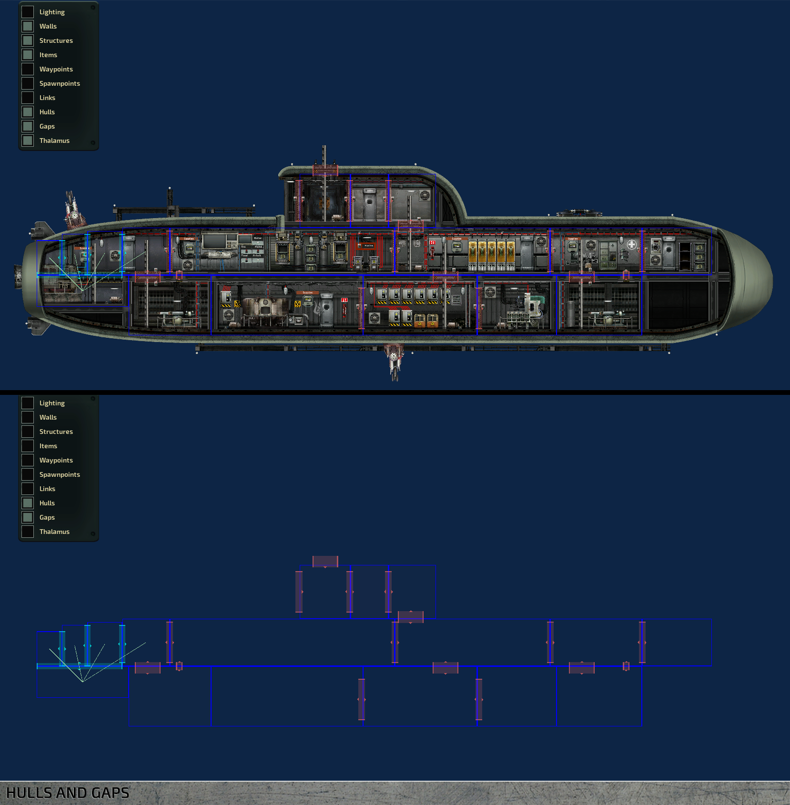

## Wiring  接线
<!-- A good number of devices in a submarine have to be wired into a power source to be powered, while others rely on specific signals, also delivered via wiring, to work in the way they’re intended. Entering the wiring mode in the sub editor allows you to run wires between devices like you would in\-game. When wiring mode is toggled on, a selection of differently colored wires appears on the left hand side. Color differences are purely cosmetic, but there is a tradition of using red wires for power and blue for signals.-->
潜艇中大量的设备都需要为其接通电源供能才能工作，而其余的也依靠线路运输的特殊信号实现预定的功能。进入潜艇的接线模式能使你可以像在游戏中那样布线。当你打开接线模式，你可以在左边看到不同颜色的导线以供选择。虽然导线颜色只起到个性化的作用，但默认是欧阳那个红色的线走电，蓝色的线走信号。  

<!-- After selecting a wire, it is added to your inventory and equipped, along with a screwdriver. From here, wiring works like it does in\-game. With the wire equipped, open the item’s wiring interface \(default ‘E’\) to add connections. Please refer to the in\-game Engineer training for more details.-->  
再选好导线后，其被加入你的物品列表并装备上，与螺丝刀一起。从这之后，接线的工作就像游戏里面那样。当导线装备好时，打开要接线物品的接线交互页面（默认对其按e键）来创造连接。详情请参考游戏中的电工教学。  

<!-- When a wire is placed, it can be selected by clicking on it in wiring mode. Add a node by CTRL+clicking on the length of a wire. Move points by left\-clicking and dragging. -->  
当线接好后，可以在接线模式中点击选中，通过 ctrl+点击 导线上的一部分可以创造一个节点。而左键点击节点可以拖拽节点。  

## Nuclear reactor and power grid  核反应堆与电网
<!-- The **nuclear reactor** is the source of almost all the power on board the submarine. It is the engineers' responsibility to keep reactors running, so each reactor in the sub should be assigned an engineer. In most cases, having one is enough. They have a tendency to overheat and eventually explode if not operated correctly, so place them a safe distance away from other vital devices. -->  **核反应堆** 是潜艇上几乎所有电力的源头。工程师（电工）的职责便是保证其运行。所以每个潜艇中的反应堆都应该有i个电工专门负责。在大多情况系，一个燃料棒就足够了。如果操作不当，反应堆便有过热的趋势最终导致爆炸，所以其应离那些与船员性命攸关的设备保持安全距离。  

<!-- Power is distributed through the sub via **junction boxes** , as devices cannot draw power straight from the reactor. Power wires need to be connected to junction boxes to calculate the grid’s power load correctly. -->  
电力在潜艇中通过接线盒分配，因为设备不能直接从反应堆获得能源。通过将电线与接线盒连接才能正确计算出电网的电力负载。  

<!-- There are two major ways to wire power in a sub.  
- Place junction boxes in each room, close to devices they're providing power to, or
- Group all junction boxes in a separate electrical room, where they can all be easily accessed. -->  
这里有两种主流的接电线的方式：  
- 在每个房间中都配置接线盒，靠近用电器。  
- 将所有接线盒集中在接线盒室以方便检修。  

<!-- The first solution makes troubleshooting easier, because problems can usually be traced to the closest junction box. On the other hand, grouping all junction boxes together makes them easier to maintain. -->  
第一种方式方便检修设备故障，因为你可以很容易追溯到其最近的接线盒。而第二种则主要室方便维护接线盒。  

<!-- **TIP:** In most cases, it’s smart to keep everything in the same grid because the reactor always outputs the same amount of power to each grid. If there are two power grids with different loads, the one with the lower load will be overloaded and its junction boxes damaged. If you want to use multiple power grids, make sure their power requirements are balanced. -->  
**提示:** 在大多数情况下，所有设备使用一套电网是较为明智的。  

<!-- **TIP:** Install wires along walls and ceilings and use cable holders. It looks neater and more organized. -->  
**提示:** 沿着墙壁和舱室顶接线并使用走线槽（cable holder)可以让线路看起来更整洁有序。  

## Engines, ballast and navigation 引擎、压载舱与导航终端
<!-- **Engines** provide thrust. You must place the engine so that its back half is in water and the front half inside the sub, or it will be damaged by water. You can use multiple engines to apply more force, but keep in mind their power consumption, which can be high and fluctuate when changing direction sharply. -->  
**引擎**能提供推力，而您务必将引擎的后半段放置于舱外，前半段放置于舱内，否则其可能会侵水受损。你可以用更多引擎来增强推力，但您需要注意他们的电力消耗，在快速改变速度方向时可能将导致其电力需求大幅波动。  

<!-- An engine’s maximum force can be adjusted in the editor. This is useful if the sub’s horizontal movement can’t keep up with its ascent/descent speed or vice versa, which makes steering very difficult \(and can and will result from the engines and ballasts being out of balance\). -->  
在编辑器中可以调整引擎的最大推力。其将有效改善潜艇水平运动跟不上或者远超竖直上升\下降速度导致难以驾驶 \(并将会导致引擎和压载舱失衡\)的情况。  

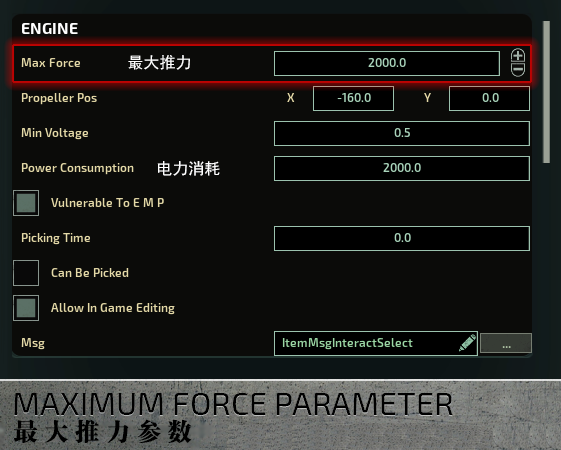

<!-- Where engines provide horizontal movement, **ballast tanks** are responsible for vertical movement. In their simplest state, they are empty rooms that contain a water pump. The pump is programmed to let water in to make the sub heavier or pump it out to make it lighter. This results in the sub either ascending or descending. -->  
引擎负责水平运动，而**压载舱**负责竖直方向运动。在最简单的情形下，压载舱就是空舱室配上一个水泵。水泵被设计为吸水使潜艇变重；排水使潜艇变轻，最终导致潜艇的下降或上升。  

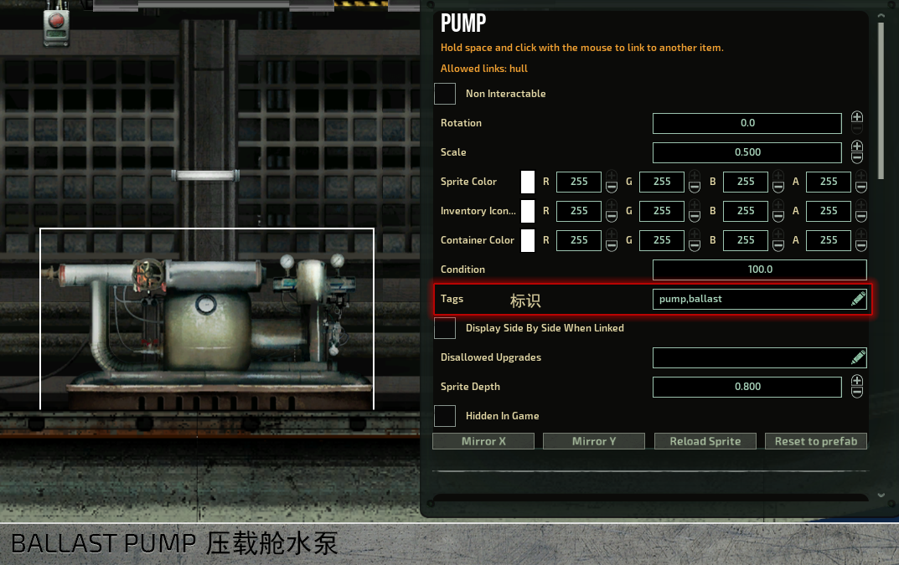

<!-- **TIP:** There can be any number of ballast tanks, although an optimal number is two or even three. One ballast can be fine, but then you run the risk of the sub being completely immobile if it gets punctured. -->  
**提示:** 潜艇中允许任意数量的压载舱，但一般最适宜的数量时两到三个。只有一个压载舱也行，但这面临着当其受损潜艇将完全不可移动的风险。  

<!-- **TIP:** A natural place for a ballast tank would be on the bottom. Otherwise you will run into all kinds of issues ranging from leaks to maintenance problems. -->  
**提示:** 压载舱一般放在潜艇底部，否则你可能与遇到从漏水到维护的各种问题。

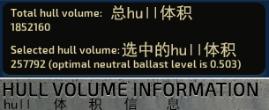

<!-- The size of a ballast tank is an important factor in a sub’s handling. If it’s too small, the sub may not be able to descend; too big, and it may sink too easily. Aim for a combined neutral ballast level of .5 for optimal size. The size of a hull is shown in the upper left corner of the viewport when a hull is selected. Selecting multiple hulls will give their combined optimal neutral ballast level. Neutral ballast levels that differ from the standard .5 can be taken into account in the navigation terminal. Look for a ‘Neutral Ballast Level’ field and change it to whatever is suitable. -->  
压载舱的规模是潜艇操控性能的一个重要因素。如果太小了，那么潜艇可能无法上浮；如果太大了，那么潜艇可能容易下沉。力求将总**平衡压载舱水位**（neutral ballast level）为0.5是最好的选择。hull的规模可以将在你选中的时候显示在左上角，同时选中多个压载舱将显示他们的平衡总压载舱水位。如果平衡压载舱水位与标准的0.5不同，可以选中导航终端找到“Neutral Ballast Level"，将其修改成与潜艇匹配的数值以消除误差。  

<!-- Engines and ballast levels are controlled via the navigation terminal. The terminal parses the direction given by the navigator in the sonar display and sends a signal to the engine \(‘velocity_x_out’ to ‘set_force’\) and ballast pumps \(‘velocity_y_out’ to ‘set_targetlevel’\). -->  
引擎和压载舱的水位可以通过导航终端控制。导航终端回解析导航员在声纳显示里选择的方向，并将信号传递给引擎\(从"水平速度输出”到“设置推力”\)
和水泵\(从“垂直速度输出”到“设置目标水位”\)。  
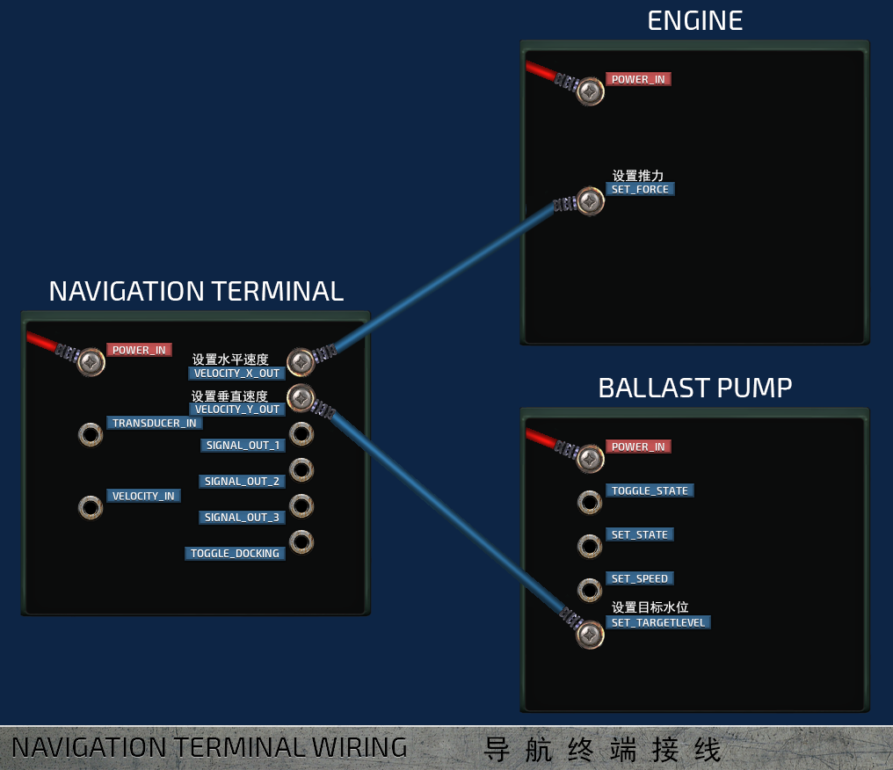

## Weapons systems 武器系统
<!-- Turrets are the basic defense measure any standard sub should have. All turrets consists of a gun to launch the projectiles, a loader to load the ammunition, and a periscope to control the gun. -->  
炮台是任何一个合格的潜艇都应该有的最基本的防御手段。所有炮台都由以下结构组成：一门能发射弹药的炮，一个装填弹药的装弹器，和一个控制炮的潜望镜。  

<!-- All turrets use a lot of power in short bursts when they fire. These power spikes are more than regular batteries can handle, which can causes the power grid to fluctuate wildly. Therefore, it's best to use supercapacitors to power the sub's guns. Their capacity is low and the output high. -->  
所有的炮台都会在开火时在瞬间内消耗大量电力。这种突变导致的剧烈电网波动远不是一般的电池能解决的。因此，最好使用超级电容去为潜艇炮台供电，因为它们的容量很小，但是输出很高。  

<!-- For any type of turret to work, their loaders must be linked to the gun \(by selecting one, then holding space and clicking on the other\) and a periscope must be placed somewhere to control them. Periscopes output a ‘position_out’ and a ‘trigger_out’ signals, which should be connected to ‘position_in’ and ‘trigger_in’ inputs in the turret itself. -->  
无论是哪种炮台，都需要与装弹器连接（通过选中其中一者再按住空格点另一个）在才能发射。同样地，也需要放置一个潜望镜并将其接线———“位置输出”接炮台“位置输入”，“触发输出”接炮台“触发输入”——才能控制炮台。  

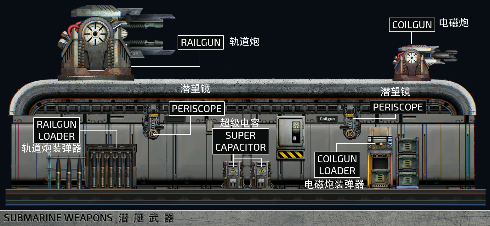

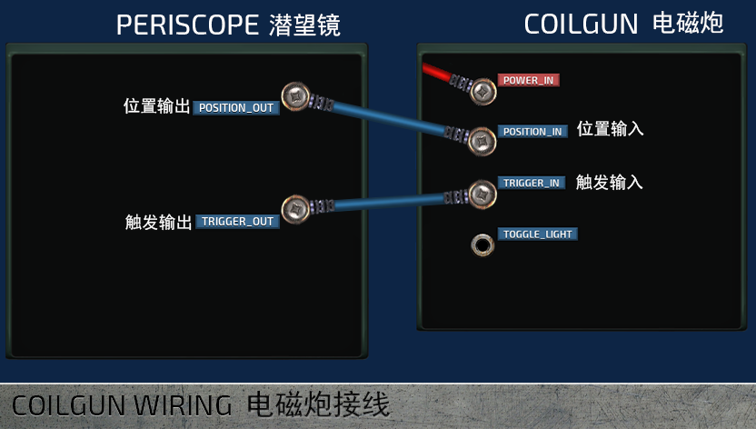

<!  **Depth charges** require a depth charge loader and a tube. Depth charge loaders should be linked to depth charge tubes on the outer hull. Charges are launched by giving the tube an activation signal, usually via a button. -->  
**深水炸弹**需要一个深水炸弹装弹器和一个深水炸弹投放器。装弹器需要和潜艇外部的投放器相连。当给投放器一个激发信号（往往是通过一个按钮)便可以投放炸弹。  

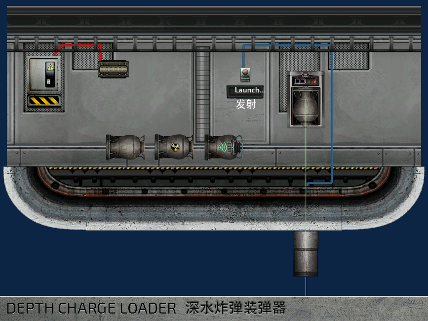

**Electric discharge coils** work similarly to depth charges. They need to be wired into the power grid and given an activation signal. The actual coil is placed on the outer hull. When activated, the coil creates an electrical discharge that travels along the submarine’s outer hull and stuns any monsters nearby. The range of the electric shock created is set in the discharge coil item in the editor along with a multiplier when traveling along walls.

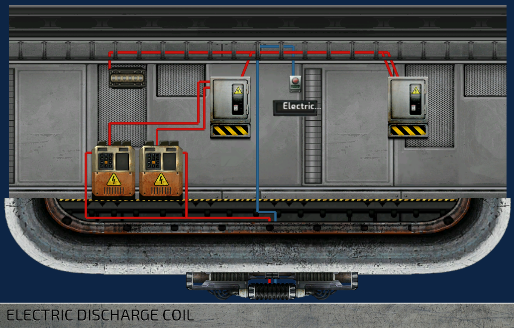

## Oxygen
**Oxygen generators** generate oxygen and thus breathable air for the entire sub. Like everything else on board, they require power to function, and they must be linked to an oxygen vent in any hull that is supposed to have breathable air. To link the generator to a vent, select the oxygen generator, then hold space and click the vent. You should see a green line between the items. If not, check if you have ‘Links’ displayed on the left hand side of the screen. If not, check if you have ‘Links’ toggled on in the visibility list.

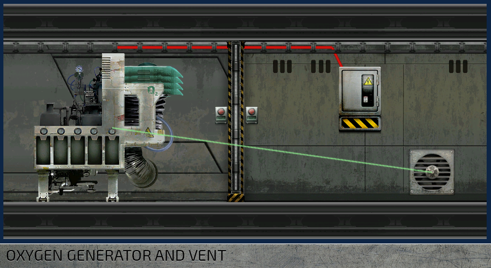

The amount of oxygen needed is based on the hull volume and the size of the crew. Oxygen levels are hull specific, which means the more crew members in a hull, the more quickly its oxygen level is depleted. Oxygen moves between hulls via gaps.

## Airlock, docking and cargo bay
Any submarine worth its salt has a way for a person to enter and exit it without excessive flooding. A standard **airlock** has a setup of multiple doors that stop the water before it gets further inside and a water pump to get rid of it once the airlock is closed.

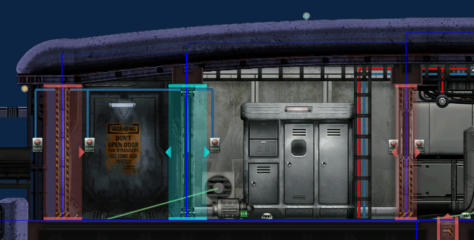

**Docking ports** are devices that clamp two structures \(submarines, shuttles, outposts etc.\) together, making it possible to walk from one to the other without getting your feet wet. Docking ports act independently from hatches and doors, so remember to also place a hatch wherever a port is to control passage.

**TIP:** A good way to wire a docking port is to link it to its hatch. When the port is engaged, the hatch opens. Find a working example in the sub editor’s Item assemblies category.

## Containers
There are quite a lot of items in the game, which the player can find or buy in the stores. All these items need a place somewhere in the submarine, and for that we need various containers. You can set a container to be filled automatically by enabling the 'Auto Fill' flag for the 'ItemContainer' component. For the autofilling to work, you'll need to mark the container with a tag, so that the game knows what kind of items the container should contain.

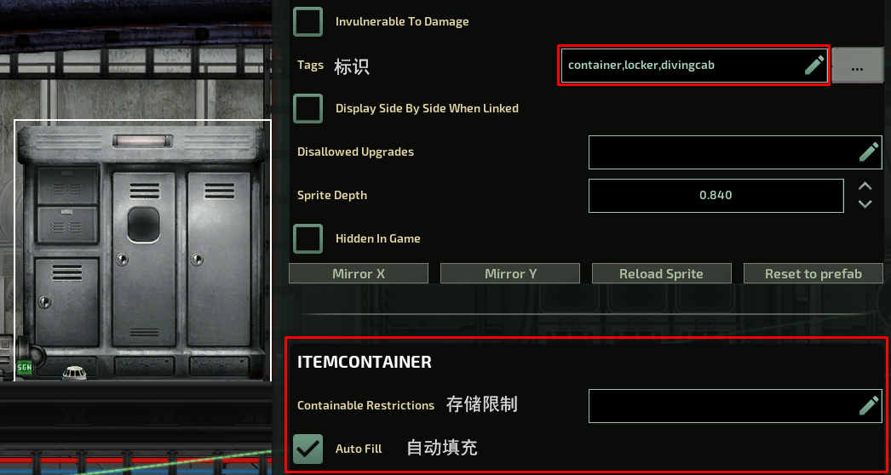

Some tags are defined in the prefab level, in the .xml files. Others need to be manually added in the editor. The important tags that need to be manually added are:

- **engcab**: Tools and other items need for the maintenance tasks.
- **reactorcab**: Reactor fuel, screwdrivers, and other items that might be needed in the reactor room.
- **divingcab**: Items needed when you exit the submarine. Plasma cutters, underwater scooters etc.
- **supplycab**: Emergency items and a diving mask.
- **armcab**: Weapons and ammunition.
- **secarmcab**: Lethal weapons and explosives.
- **medcab**: Medicines.
- **medfabcab**: Medical ingredients.
- **toxcab**: Poisons and dangerous substances.
- **storagecab**: Materials used for fabricating.
- **mineralcab**: Minerals.

**TIP:** You can also reserve the container for specific items only by adding tags or identifiers of those items in the 'Containable Restrictions' field.

## Equipment and security
To prevent traitors and other undesirables from causing too much damage, it may be smart to lock weapons and explosives somewhere where only authorized personnel can reach them.

To do this, add a tag to the 'picked required' field of a door. Then add the the same tag to at least one of the spawn points. The 'ID Card tags' defined in the spawnpoint are copied for all characters that spawn at that specific point, giving them access to different parts of the submarine.

For example: to only allow security officers to open a door, add a tag, e.g. 'id_security', to both the door and to the security officer’s spawn point. The tag can be whatever you define but it has to match in both places.

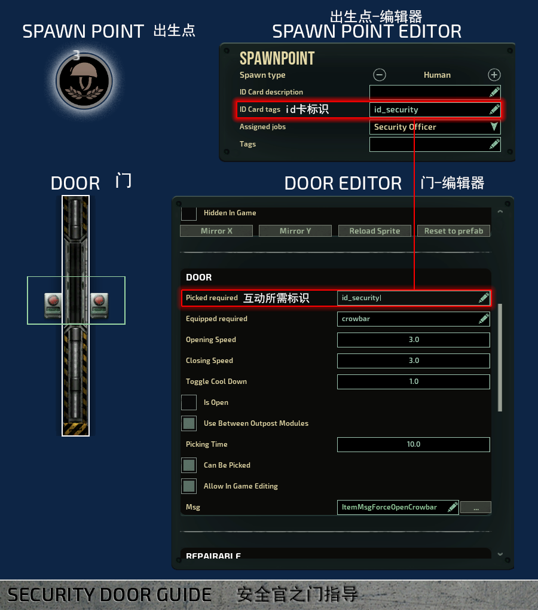

Now anyone who spawns at this spawn point has the tag ‘id_security’ on their ID Card, allowing them to open the door.

**TIP:** To place items in containers in sub editor, right\-click on the container and select ‘Open’ to open the interface. You can now search and filter items and place them in directly. To delete items from the container, drag and drop them to the entity catalog in the bottom.

**TIP** : The “picked required” field essentially means “the character has to have an item with this name or tag in their inventory to interact with this item/device”. It can be used to restrict access to other items than doors as well, or for example to require a specific tool to interact with some device.

## Waterproofing
There are a few ways to combat flooding inside a submarine.

Pumps are the primary way of getting rid of water, but they consume relatively high amounts of power. Having too many pumps turn on simultaneously causes unnecessary power fluctuations. Instead of placing pumps in every room, duct blocks can be used to let water flow into designated bilge compartments. There doesn’t need to be a separate bilge space, usually it is enough to place a pump on the bottom\-most room and route the water there.

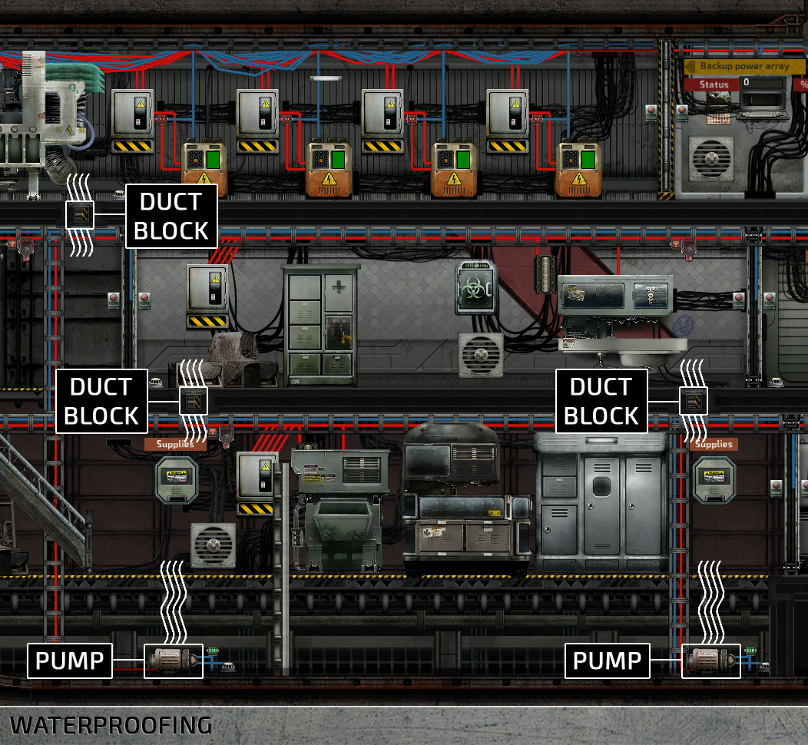

Compartmentalizing the space is a good way to make sure a small leak doesn’t turn into a catastrophe. The larger the rooms on a sub, the further water can advance without obstacles. Remember to close doors behind you, otherwise they’re useless. A good move would be to use doors that close automatically, which is why the game's vanilla subs come with auto\-closing doors. Hate them or love them, they're for your own protection!

## Waypoints
All AI characters need waypoints to get around the submarine. Waypoints can be placed manually, but a far easier way to do it is with the ‘Generate waypoints’ button on the left side of the screen. After waypoints are generated, they can be fine\-tuned manually, if needed.

It's a good practice to generate the waypoints once items and structures are already in place. Also, if you remove or add doors, stairs, or ladders, remember to add waypoints too to prevent the AI from getting stuck.

## Editing multiple properties
This highly requested feature has finally been implemented! If you have multiple entities selected and change a property in the top right entity editor, the changes will be applied to all items in your selection. This works for any item and any property. Colors, toggles, labels, tags...you name it.

**IMPORTANT:** Multiple editing has some limitations. For example, OxygenGenerator and Engine both have the Power Consumption property, but they can still not be edited simultaneously because they are part of different item components. By contrast, editing the ‘Auto Fill’ property on a Supplies Cabinet and a Steel Locker, for instance, will work, because the property that is being edited is part of the ItemContainer component which both items have.

## Autosaving
You might have noticed that there is a new button on the Load menu called Load Autosave. Every 5 minutes or when the game is paused, the editor will automatically save your submarine into a temporary file located in Submarines/.AutoSave/AutoSave.sub which will not show up in your submarine list.

If the power goes out, the game crashes, a random chimp event occurs or something else horrible happens after you’ve spent hours wiring the submarine and forgot to save, you can recover the AutoSave submarine from the Load menu.

**TIP:** All submarines share the same autosave file, so be careful what you load before recovering your submarine.

## Editor shortcuts
- W, A, S, D – Scroll
- Shift + W, A, S, D – Scroll faster
- Ctrl+1, Control+2 – Switch between edit and wiring mode.
- Q – Toggle entity catalog visibility.
- F – Centers the camera to selection.
- E – Open item interface.
- Ctrl+A – Select or deselect everything.
- Ctrl+S – Show save menu.
- Ctrl+Shift+S – Quick\-save your submarine.
- Ctrl+M, Ctrl+N – Flip item horizontally or vertically.
- Space + Left click – Link item to another \(Useful in linking hulls together or an oxygen generator to vents\).

Holding down shift while dragging or resizing items disables grid snapping.

## Thanks for reading!
We hope you found this guide helpful – feedback is always welcome, so let us know how we did. Be sure to post your subs on Barotrauma’s Steam workshop and on our [Discord server](http://discord.gg/undertow), where we have a channel dedicated to custom subs!

